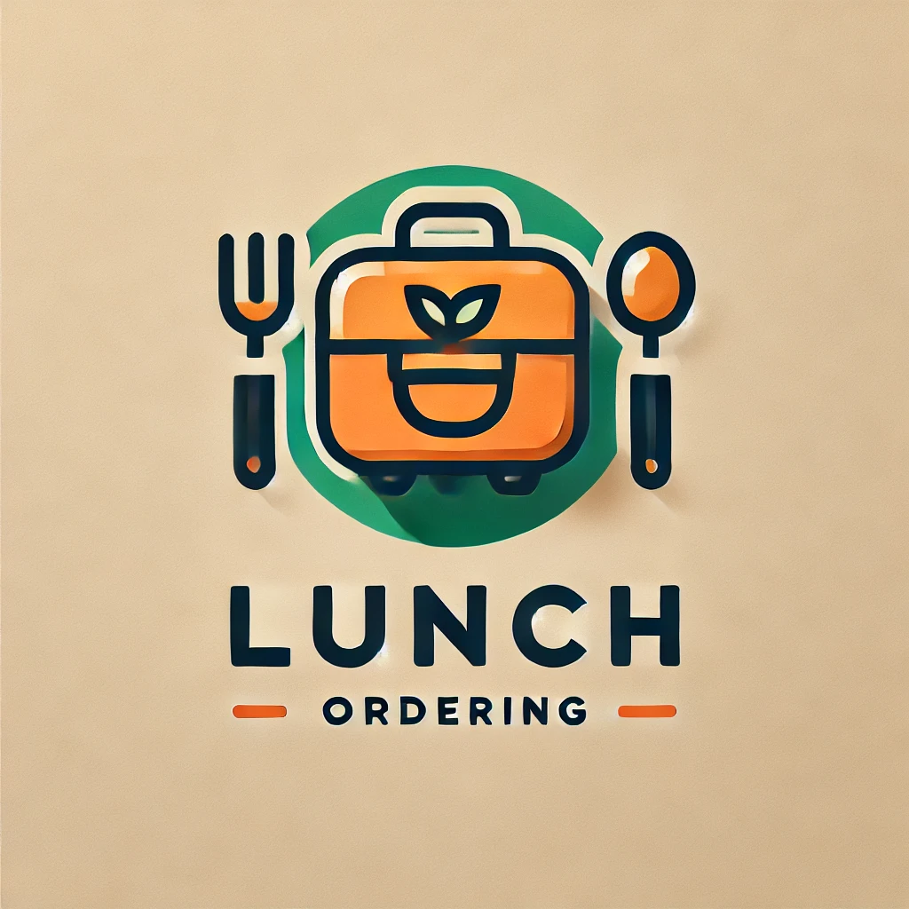

<h1>午餐訂訂</h1>
此程式讓使用者能夠自行新增餐廳，或是選擇已紀錄的餐廳開團，邀請他人共同訂餐。
詳情資料頁面會將資料整理為簡明易讀的格式，便於管理和查看。
<br>



<h2>功能</h2>
<li>由管理者來建立使用者帳號</li>
<li>使用者可以查看目前正在進行中的訂單</li>
<li>使用者可以查看餐廳清單、建立一間餐廳的資料或是編輯餐廳</li>
<li>只用者可以在喜歡的餐廳開請訂單供大家一起來訂餐</li>
<li>使用者可以在訂單資訊的頁面看到本次訂單的訂購數、訂購人、說明、總金額與餐廳資料</li>
<li>訂單的發起人和管理者可以關閉訂單也可以重新開啟</li>

<h2>系統需求</h2>

<li>Node.js v18</li>
<li>MySQL server v8</li>

<h2>安裝</h2>

git clone https:

```
git clone https://github.com/Yuii24/LunchOrdering
```
<br>
2. 開啟專案

```
code LunchOrdering
```
<br>

3. 安裝相關套件

```
npm install
```

<br />

4. 連結MySQL資料庫

  1.打開config.example<br />
  2.修改config.example上的內容，將username, password, database這三個欄位改成自己的資料<br />
  (database的部分也可以直接創建一個叫ordering的資料庫)<br />
  3.將config.example改成config.json<br />

<br />

5. 完成資料表與基礎資料的建置

用這個指令來建立資料表
```
npx sequelize db:migrate
```

用這個指令來建立管理者帳號資料
(如果想變更管理者的帳號資料可以在執行前先到seeders資料夾的檔案中更改資料)
```
npx sequelize db:seed:all
```

<br />

6. 新增.env檔案
```
touch .env
```
新增後參考.env.example輸入資料

<br />

7. 啟動應用程式

用這個指令來安裝nodemon
```
npm install -g nodemon
```
並在packages.json檔案中的scripts中加入以下指令
```
"dev": "nodemon app.js"
```

用這個指令來啟動應用程式
```
npm run dev
```

or

使用start來啟動

```
npm run start
```
